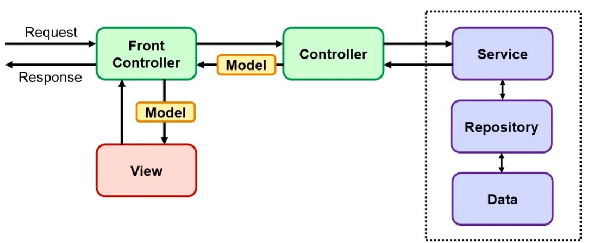

# 3D-house-creator

## Запуск
Для запуска проекта его серверную часть необходимо собрать с помощью Maven (и использовал maven 3.9.9). В папке backend введите в консоль:
```cmd
mvn package
```
(Из-за выключенной БД вылетит ошибка, но jar-файлы создадуться, что позволит поднять контейнеры)
Также, для запуска проекта установите Docker. Скачайте репозиторий и введите команду ***в корне проекта***: 
```docker
    docker-compose up -d
```
Для остановки работы программы введите:
```docker
    docker-compose down --volumes
```

Проект будет выстроен по этой архитектуре (Views для ускорения работы с БД)
